<div align="center">

<div align="center">
  
</div>


<br/>

[](https://github.com/ferrdishx)


</div>

---

## `$ whoami`

```sh
ferrdish@arch ~ → cat about.txt
```

```
Name    : ferrdish
Focus   : idk
OS      : CachyOS
Editor  : whatever gets the job done
Status  : actively breaking and fixing things
```

I build tools that target **real performance**, not benchmarks. My work lives at the intersection of **Android system internals** and **Linux power-user environments**  from Magisk modules tuning to shell utilities that just work.

---

## `$ ls skills/`

<div align="left">

| Domain | Tools |
|---|---|
| **Android** | Magisk, kernel parameters, SELinux, ADB/Fastboot |
| **Linux** | Arch ecosystem, CachyOS, sysctl tuning, systemd |
| **Scripting** | Bash/Shell, Lua, POSIX sh |
| **Tooling** | Git, GitHub Actions, WebUI integration |

</div>

<p align="left">
  
  
  
  
  
  
</p>

---

## `$ cat projects/featured.md`

<table>
  <tr>
    <td width="50%" valign="top">
      <h3>⚙️ LMK Controller</h3>
      <p>Advanced memory management module for Android, built on top of <strong>LMK</strong> with a built-in <strong>WebUI</strong>. Offers performance presets, granular tuning, and real-world stability improvements for daily-driver use.</p>
      <p>
        
        
        
      </p>
    </td>
    <td width="50%" valign="top">
      <h3>🔇 NoBeep</h3>
      <p>A focused mobile utility built around <strong>clean UX</strong> and minimal system footprint. Integrates seamlessly into the Android environment without bloat or unnecessary permissions.</p>
      <p>
        
        
        
      </p>
    </td>
  </tr>
</table>

---

## `$ neofetch --stats`

<div align="center">
  
</div>

<div align="center">
  
  
</div>

---

## `$ tail -f activity.log`

<div align="center">
  
</div>

---

## `$ cat /etc/philosophy`

```sh
# core principles
DESIGN="minimalist"
CODE="high-efficiency"
TARGET="real-world usage, not synthetic benchmarks"
APPROACH="break it → understand it → build it better"
```

---

## `$ ping ferrdish`

<p align="left">
  <a href="https://github.com/ferrdishx">
    
  </a>
</p>

<div align="center">
  <br/>
  <sub>
    <code>// "Build things people actually use."</code>
  </sub>
</div>
